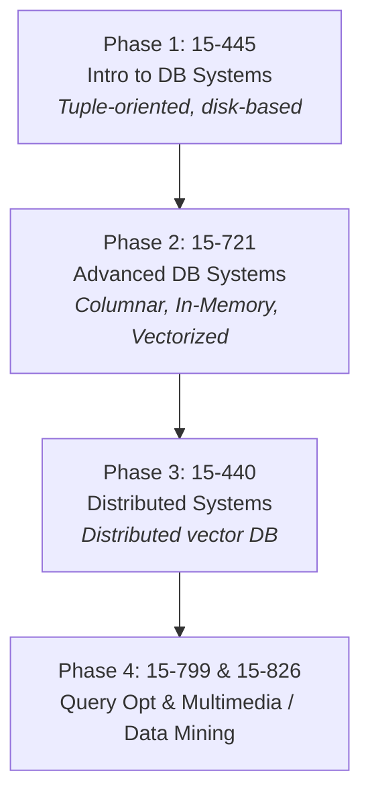

# db-labs: Master Roadmap & Vision

This repository (`db-labs`) is a comprehensive workspace for building a **distributed vector analytical database** from scratch in Rust. The journey is mapped across four foundational Carnegie Mellon University (CMU) courses, evolving the database from a simple tuple-engine into a state-of-the-art multimedia/vector analytics engine.

---

## 🗺️ The Grand Architecture

---

## Phase 1: CMU 15-445 / 645 (Intro to DB Systems)
**Goal:** Build a single-node, tuple-oriented storage engine.

### Lecture Schedule + YouTube Links
| # | Topic | Video | Notes | Related |
|---|-------|-------|-------|---------|
| 01 | Relational Model | [Watch](https://www.youtube.com/watch?v=7NPIENPr-zk&list=PLSE8ODhjZXjYMAgsGH-GtY5rJYZ6zjsd5&index=1) | [PDF](https://15445.courses.cs.cmu.edu/fall2025/notes/01-relationalmodel.pdf) | |
| 02 | Modern SQL | [Watch](https://www.youtube.com/watch?v=O5gU9NQjCAs&list=PLSE8ODhjZXjYMAgsGH-GtY5rJYZ6zjsd5&index=2) | [PDF](https://15445.courses.cs.cmu.edu/fall2025/notes/02-modernsql.pdf) | HW1: SQL |
| 03 | Storage I (Disk, Pages) | [Watch](https://www.youtube.com/watch?v=PRLXdIMJhOg&list=PLSE8ODhjZXjYMAgsGH-GtY5rJYZ6zjsd5&index=3) | [PDF](https://15445.courses.cs.cmu.edu/fall2025/notes/03-storage1.pdf) | |
| 04 | **Buffer Pools** | [Watch](https://www.youtube.com/watch?v=8-2yv4z0VZc&list=PLSE8ODhjZXjYMAgsGH-GtY5rJYZ6zjsd5&index=4) | [PDF](https://15445.courses.cs.cmu.edu/fall2025/notes/04-bufferpool.pdf) | **→ P1 starts** |
| 05 | Storage II (Tuples, Pages) | [Watch](https://www.youtube.com/watch?v=2_sTdS4h-bY&list=PLSE8ODhjZXjYMAgsGH-GtY5rJYZ6zjsd5&index=5) | [PDF](https://15445.courses.cs.cmu.edu/fall2025/notes/05-storage2.pdf) | HW2: Storage |
| 06 | Storage III (Log-Structured) | [Watch](https://www.youtube.com/watch?v=yWnToWrskXE&list=PLSE8ODhjZXjYMAgsGH-GtY5rJYZ6zjsd5&index=6) | [PDF](https://15445.courses.cs.cmu.edu/fall2025/notes/06-storage3.pdf) | |
| 07 | Hash Tables | [Watch](https://www.youtube.com/watch?v=nuNW8IfgPNU&list=PLSE8ODhjZXjYMAgsGH-GtY5rJYZ6zjsd5&index=7) | [PDF](https://15445.courses.cs.cmu.edu/fall2025/notes/07-hashtables.pdf) | |
| 08 | B+ Tree Indexes I | [Watch](https://www.youtube.com/watch?v=u7ii_Lvm9rM&list=PLSE8ODhjZXjYMAgsGH-GtY5rJYZ6zjsd5&index=8) | [PDF](https://15445.courses.cs.cmu.edu/fall2025/notes/08-indexes1.pdf) | HW3: Indexes |
| 09 | B+ Tree Indexes II | [Watch](https://www.youtube.com/watch?v=PjST2n7abAY&list=PLSE8ODhjZXjYMAgsGH-GtY5rJYZ6zjsd5&index=9) | [PDF](https://15445.courses.cs.cmu.edu/fall2025/notes/09-indexes2.pdf) | |
| 10 | **Index Concurrency** | [Watch](https://www.youtube.com/watch?v=YgOvfXl6pss&list=PLSE8ODhjZXjYMAgsGH-GtY5rJYZ6zjsd5&index=10) | [PDF](https://15445.courses.cs.cmu.edu/fall2025/notes/10-indexconcurrency.pdf) | **→ P2 starts** |
| 11 | Sorting & Aggregations | [Watch](https://www.youtube.com/watch?v=LzyKTpeIgts&list=PLSE8ODhjZXjYMAgsGH-GtY5rJYZ6zjsd5&index=11) | [PDF](https://15445.courses.cs.cmu.edu/fall2025/notes/11-sorting.pdf) | |
| 12 | Join Algorithms | [Watch](https://www.youtube.com/watch?v=YIdIaPopfpk&list=PLSE8ODhjZXjYMAgsGH-GtY5rJYZ6zjsd5&index=12) | [PDF](https://15445.courses.cs.cmu.edu/fall2025/notes/12-joins.pdf) | |
| 13 | **Query Execution I** | [Watch](https://www.youtube.com/watch?v=E-UUd6cB57w&list=PLSE8ODhjZXjYMAgsGH-GtY5rJYZ6zjsd5&index=13) | [PDF](https://15445.courses.cs.cmu.edu/fall2025/notes/13-queryexecution1.pdf) | **→ P3 starts** |
| 14 | Query Execution II | [Watch](https://www.youtube.com/watch?v=Kzf1hGjtZOU&list=PLSE8ODhjZXjYMAgsGH-GtY5rJYZ6zjsd5&index=14) | [PDF](https://15445.courses.cs.cmu.edu/fall2025/notes/14-queryexecution2.pdf) | HW4: Execution |
| 15 | Query Optimization I | [Watch](https://www.youtube.com/watch?v=b53huOGcsZ8&list=PLSE8ODhjZXjYMAgsGH-GtY5rJYZ6zjsd5&index=15) | [PDF](https://15445.courses.cs.cmu.edu/fall2025/notes/15-optimization1.pdf) | |
| 16 | Query Optimization II | [Watch](https://www.youtube.com/watch?v=azTHRpzl10o&list=PLSE8ODhjZXjYMAgsGH-GtY5rJYZ6zjsd5&index=16) | [PDF](https://15445.courses.cs.cmu.edu/fall2025/notes/16-optimization2.pdf) | |
| 17 | **Concurrency Control** | [Watch](https://www.youtube.com/watch?v=tMFAgvDViAI&list=PLSE8ODhjZXjYMAgsGH-GtY5rJYZ6zjsd5&index=17) | [PDF](https://15445.courses.cs.cmu.edu/fall2025/notes/17-concurrencycontrol.pdf) | |
| 18 | Two-Phase Locking | [Watch](https://www.youtube.com/watch?v=drStlhNbfHI&list=PLSE8ODhjZXjYMAgsGH-GtY5rJYZ6zjsd5&index=18) | [PDF](https://15445.courses.cs.cmu.edu/fall2025/notes/18-twophaselocking.pdf) | HW5: Transactions |
| 19 | **Timestamp Ordering** | [Watch](https://www.youtube.com/watch?v=risHwKeWbBM&list=PLSE8ODhjZXjYMAgsGH-GtY5rJYZ6zjsd5&index=19) | [PDF](https://15445.courses.cs.cmu.edu/fall2025/notes/19-timestampordering.pdf) | **→ P4 starts** |
| 20 | Multi-Version CC (MVCC) | [Watch](https://www.youtube.com/watch?v=tUFha9-DuSk&list=PLSE8ODhjZXjYMAgsGH-GtY5rJYZ6zjsd5&index=20) | [PDF](https://15445.courses.cs.cmu.edu/fall2025/notes/20-multiversioning.pdf) | |
| 21 | Logging Schemes | [Watch](https://www.youtube.com/watch?v=CedEy54pe3g&list=PLSE8ODhjZXjYMAgsGH-GtY5rJYZ6zjsd5&index=21) | [PDF](https://15445.courses.cs.cmu.edu/fall2025/notes/21-logging.pdf) | |
| 22 | Recovery Algorithms | [Watch](https://www.youtube.com/watch?v=X2jc4qalNy0&list=PLSE8ODhjZXjYMAgsGH-GtY5rJYZ6zjsd5&index=22) | [PDF](https://15445.courses.cs.cmu.edu/fall2025/notes/22-recovery.pdf) | HW6: Recovery |
| 23 | Distributed DBs I | [Watch](https://www.youtube.com/watch?v=IFLQBWY6dlE&list=PLSE8ODhjZXjYMAgsGH-GtY5rJYZ6zjsd5&index=23) | [PDF](https://15445.courses.cs.cmu.edu/fall2025/notes/23-distributed1.pdf) | |
| 24 | Distributed DBs II | [Watch](https://www.youtube.com/watch?v=pQh5fka3FC0&list=PLSE8ODhjZXjYMAgsGH-GtY5rJYZ6zjsd5&index=24) | [PDF](https://15445.courses.cs.cmu.edu/fall2025/notes/24-distributed2.pdf) | |
| 25 | Potpourri | [Watch](https://www.youtube.com/watch?v=qiVUf9X6ItM&list=PLSE8ODhjZXjYMAgsGH-GtY5rJYZ6zjsd5&index=25) | | |

### Projects → What You'll Build in Rust

**P0: Rust Primer (skip or adapt)**
*   **Original:** C++ Trie / Copy-on-Write Trie
*   **Your Rust version:** Use this as a warm-up to practice ownership, `Rc<RefCell<T>>`, the newtype pattern, and module organization
*   **Watch first:** L01-02
*   **Status:** Optional — jump straight to P1 if you're comfortable with Rust

**P1: Buffer Pool Manager ← YOU ARE HERE**
*   **What to build:** LRU/LRU-K/Clock/ARC Replacer → Disk Manager → Buffer Pool Manager → Page Guards
*   **Watch first:** L03 (Storage I) + L04 (Buffer Pools)
*   **Key concepts:** Page-oriented storage, eviction policies, pin/unpin, dirty page management, RAII guards
*   **Rust learning:** `Drop` trait, interior mutability, arena allocators, `Deref`/`DerefMut`

**P2: Database Index**
*   **What to build:** B+ Tree with concurrent access (search, insert, delete, iterator)
*   **Watch first:** L07 (Hash Tables) + L08-09 (B+ Trees) + L10 (Index Concurrency)
*   **Key concepts:** B+ Tree invariants (sorted keys, balanced, leaf chaining), Latch crabbing / latch coupling for concurrent access
*   **Rust learning:** Recursive data structures, `unsafe` for node pointers, `RwLock` for latch crabbing, iterator trait implementation

**P3: Query Execution**
*   **What to build:** Executor engine using the Volcano/iterator model
*   **Watch first:** L11 (Sorting) + L12 (Joins) + L13-14 (Execution) + L15-16 (Optimization, at least basics)
*   **Operators:** Sequential Scan, Index Scan, Insert, Update, Delete, Nested Loop Join, Hash Join, Aggregation, Sort, Limit
*   **Key concepts:** Volcano model (`init()`/`next()`/`close()`), Expression evaluation and tuple schema, External merge sort for data that doesn't fit in memory
*   **Rust learning:** Trait objects / dynamic dispatch (`Box<dyn Executor>`), generics, enum-based expression trees, lifetime management for borrowed tuples

**P4: Concurrency Control**
*   **What to build:** Lock manager + transaction manager with 2PL and deadlock detection
*   **Watch first:** L17 (CC Theory) + L18 (2PL) + L19 (Timestamp Ordering) + L20 (MVCC)
*   **Key concepts:** Lock types (S, X, IS, IX, SIX), Two-Phase Locking, Deadlock detection via wait-for graph, Isolation levels (RU, RC, RR, SERIALIZABLE)
*   **Rust learning:** `Mutex`, `Condvar`, `RwLock`, lock ordering, `unsafe` for lock-free structures, `Arc` for shared ownership across threads

---

## Phase 2: CMU 15-721 (Advanced Database Systems)

> [!IMPORTANT]
> This is a paper-reading course. Each lecture assigns 1-2 papers to read beforehand. The papers ARE the curriculum.

**Goal for db-rs:** Transform your tuple-oriented engine into a **columnar, vectorized analytical engine** with SIMD.

| # | Topic | Key Paper | What to build in db-rs |
|---|-------|-----------|------------------------|
| 1 | Modern OLAP | [Lakehouse (CIDR'21)](https://15721.courses.cs.cmu.edu/spring2024/papers/01-modern/armbrust-cidr21.pdf) | Architecture redesign |
| 2 | Columnar Storage I | [Columnar Formats (VLDB'23)](https://15721.courses.cs.cmu.edu/spring2024/papers/02-data1/p148-zeng.pdf) | Columnar page layout (PAX/DSM) |
| 3 | Columnar Storage II | [FastLanes Compression (VLDB'23)](https://15721.courses.cs.cmu.edu/spring2024/papers/03-data2/p2132-afroozeh.pdf) | Column compression (RLE, delta, dict) |
| 4 | Vectorized Exec I | [MonetDB/X100 (CIDR'05)](https://15721.courses.cs.cmu.edu/spring2024/papers/04-execution1/boncz-cidr2005.pdf) | Batch-at-a-time execution |
| 5 | Vectorized Exec II | [Velox (VLDB'22)](https://15721.courses.cs.cmu.edu/spring2024/papers/05-execution2/p3372-pedreira.pdf) | Unified execution engine |
| 6 | **SIMD** | [Rethinking SIMD (SIGMOD'15)](https://15721.courses.cs.cmu.edu/spring2024/papers/06-vectorization/p1493-polychroniou.pdf) | **SIMD scan/filter/hash operations** |
| 7 | Query Compilation | [Compiling Queries (VLDB'11)](https://15721.courses.cs.cmu.edu/spring2024/papers/07-compilation/p539-neumann.pdf) | JIT/compiled query pipelines |
| 8 | Scheduling | [Morsel-Driven Parallelism (SIGMOD'14)](https://15721.courses.cs.cmu.edu/spring2024/papers/08-scheduling/p743-leis.pdf) | NUMA-aware multi-core query scheduling |
| 9 | Hash Joins | [13 Equi-Joins (SIGMOD'16)](https://15721.courses.cs.cmu.edu/spring2024/papers/09-hashjoins/schuh-sigmod2016.pdf) | Optimized hash join variants |
| 10 | Multi-way Joins | [WCO Joins (VLDB'20)](https://15721.courses.cs.cmu.edu/spring2024/papers/10-multiwayjoins/p1891-freitag.pdf) | Worst-case optimal joins |
| 11 | UDFs | [Froid (VLDB'17)](https://15721.courses.cs.cmu.edu/spring2024/papers/11-udfs/p432-ramachandra.pdf) | UDF inlining/optimization |
| 12 | Networking | [Protocol Redesign (VLDB'17)](https://15721.courses.cs.cmu.edu/spring2024/papers/12-networking/p1022-muehleisen.pdf) | Wire protocol (Arrow Flight, gRPC integration) |
| 13 | Optimizer I | [Cascades Framework ('95)](https://15721.courses.cs.cmu.edu/spring2024/papers/13-optimizer1/graefe-ieee1995.pdf) | Top-down cost-based optimizer |
| 14 | Optimizer II | [Unnesting Queries (BTW'15)](https://15721.courses.cs.cmu.edu/spring2024/papers/14-optimizer2/neumann-btw2015.pdf) | Subquery decorrelation rules |
| 15 | Optimizer III | [Adaptive Query Processing (CIDR'15)](https://15721.courses.cs.cmu.edu/spring2024/papers/15-optimizer3/babu-cidr2015.pdf) | Adaptive/learned optimization models |
| 16 | Cost Models | [How Good are Optimizers? (VLDB'15)](https://15721.courses.cs.cmu.edu/spring2024/papers/16-costmodels/p204-leis.pdf) | Cardinality estimation improvements |
| 17 | Case Study | [Dremel/BigQuery (VLDB'20)](https://15721.courses.cs.cmu.edu/spring2024/papers/17-bigquery/p3461-melnik.pdf) | Inspiration for distributed architecture |

**Rust skills:** `std::arch` SIMD intrinsics, `unsafe` for zero-copy deserialization, arena allocators (`bumpalo`), `rayon` for morsel-driven parallelism, advanced trait system (GATs, associated type bounds).

---

## Phase 3: CMU 15-440 (Distributed Systems)

**Goal for db-rs:** Make your analytical engine **distributed** — partitioned, replicated, fault-tolerant.

| Module | Topics | What to build | Resources |
|--------|--------|---------------|-----------|
| Foundations | RPC, serialization | gRPC/Tonic network layer | [Tonic docs](https://docs.rs/tonic), [Cap'n Proto](https://capnproto.org/) |
| Concurrency | Threads, goroutines, channels | Async runtime (`tokio`) integration | [Tokio tutorial](https://tokio.rs/tokio/tutorial), [Rust Atomics & Locks](https://marabos.nl/atomics/) |
| Consistency | Linearizability, causal | Consistency model for distributed reads | [Jepsen](https://jepsen.io/), [DDIA Ch. 9](https://dataintensive.net/) |
| **Consensus** | Paxos, **Raft**, leader election | **Raft consensus implementation** | [Raft paper](https://raft.github.io/raft.pdf), [Raft visualization](https://thesecretlivesofdata.com/raft/) |
| Replication | Primary-backup, quorum | Data replication across nodes | [DDIA Ch. 5](https://dataintensive.net/) |
| Partitioning | Hash, range, consistent hashing | Shard routing and rebalancing | [DDIA Ch. 6](https://dataintensive.net/) |
| Distributed Txns | 2PC, 3PC, Percolator | Distributed transaction coordinator | [Percolator paper](https://research.google/pubs/pub36726/), [TiKV Deep Dive](https://tikv.org/deep-dive/distributed-transaction/introduction/) |
| Fault Tolerance | Failure detection, membership | Health monitoring, cluster membership | [SWIM paper](https://www.cs.cornell.edu/projects/Quicksilver/public_pdfs/SWIM.pdf) |

**Rust skills:** `tokio` async runtime, `tonic` gRPC services, `serde` + `bincode`/`protobuf` serialization, lock-free structures (`crossbeam`), state machine design patterns for consensus.

---

## Phase 4: Query Optimization & Vector/Multimedia DBs

### CMU 15-799 (Advanced Query Optimization, Spring 2025)
*(Under development / TBD outline, taught by Andy Pavlo)*
- Focus: Cost models, feedback mechanisms, adaptive query optimization based on new techniques.
- Expanding on the Optimizer phases from 15-721 into a standalone deep-dive.

### CMU 15-826 (Multimedia Databases and Data Mining, Fall 2024 / 2025)
*(Final frontier for vector capabilities)*
- **Spatial & Metric Indexes:** R-Trees, k-d trees, z-ordering.
- **LSH & Vector Indexes:** HNSW, IVF-PQ. Building exact and approximate nearest neighbor (ANN) search inside your engine.
- **Graph Mining:** PageRank, anomaly detection directly in SQL.
- **Fractals & Time Series:** Advanced compression and sequence querying.
- **SVD & Matrices:** Running tensor-based calculations within the DB query engine.
