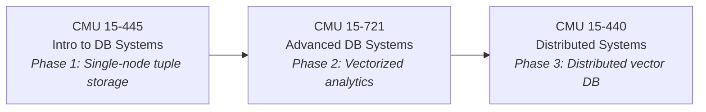

# CMU 15-445 Fall 2025 → db-rs Roadmap

Your full path: **15-445** (Phase 1: tuple storage) → **15-721** (Phase 2: vectorized analytics) → **15-440** (Phase 3: distributed)

---

## Lecture Schedule + YouTube Links

| #   | Topic                        | Video                                                                                                 | Notes                                                                            | Related           |
| --- | ---------------------------- | ----------------------------------------------------------------------------------------------------- | -------------------------------------------------------------------------------- | ----------------- |
| 01  | Relational Model             | [Watch](https://www.youtube.com/watch?v=7NPIENPr-zk&list=PLSE8ODhjZXjYMAgsGH-GtY5rJYZ6zjsd5&index=1)  | [PDF](https://15445.courses.cs.cmu.edu/fall2025/notes/01-relationalmodel.pdf)    |                   |
| 02  | Modern SQL                   | [Watch](https://www.youtube.com/watch?v=O5gU9NQjCAs&list=PLSE8ODhjZXjYMAgsGH-GtY5rJYZ6zjsd5&index=2)  | [PDF](https://15445.courses.cs.cmu.edu/fall2025/notes/02-modernsql.pdf)          | HW1: SQL          |
| 03  | Storage I (Disk, Pages)      | [Watch](https://www.youtube.com/watch?v=PRLXdIMJhOg&list=PLSE8ODhjZXjYMAgsGH-GtY5rJYZ6zjsd5&index=3)  | [PDF](https://15445.courses.cs.cmu.edu/fall2025/notes/03-storage1.pdf)           |                   |
| 04  | **Buffer Pools**             | [Watch](https://www.youtube.com/watch?v=8-2yv4z0VZc&list=PLSE8ODhjZXjYMAgsGH-GtY5rJYZ6zjsd5&index=4)  | [PDF](https://15445.courses.cs.cmu.edu/fall2025/notes/04-bufferpool.pdf)         | **→ P1 starts**   |
| 05  | Storage II (Tuples, Pages)   | [Watch](https://www.youtube.com/watch?v=2_sTdS4h-bY&list=PLSE8ODhjZXjYMAgsGH-GtY5rJYZ6zjsd5&index=5)  | [PDF](https://15445.courses.cs.cmu.edu/fall2025/notes/05-storage2.pdf)           | HW2: Storage      |
| 06  | Storage III (Log-Structured) | [Watch](https://www.youtube.com/watch?v=yWnToWrskXE&list=PLSE8ODhjZXjYMAgsGH-GtY5rJYZ6zjsd5&index=6)  | [PDF](https://15445.courses.cs.cmu.edu/fall2025/notes/06-storage3.pdf)           |                   |
| 07  | Hash Tables                  | [Watch](https://www.youtube.com/watch?v=nuNW8IfgPNU&list=PLSE8ODhjZXjYMAgsGH-GtY5rJYZ6zjsd5&index=7)  | [PDF](https://15445.courses.cs.cmu.edu/fall2025/notes/07-hashtables.pdf)         |                   |
| 08  | B+ Tree Indexes I            | [Watch](https://www.youtube.com/watch?v=u7ii_Lvm9rM&list=PLSE8ODhjZXjYMAgsGH-GtY5rJYZ6zjsd5&index=8)  | [PDF](https://15445.courses.cs.cmu.edu/fall2025/notes/08-indexes1.pdf)           | HW3: Indexes      |
| 09  | B+ Tree Indexes II           | [Watch](https://www.youtube.com/watch?v=PjST2n7abAY&list=PLSE8ODhjZXjYMAgsGH-GtY5rJYZ6zjsd5&index=9)  | [PDF](https://15445.courses.cs.cmu.edu/fall2025/notes/09-indexes2.pdf)           |                   |
| 10  | **Index Concurrency**        | [Watch](https://www.youtube.com/watch?v=YgOvfXl6pss&list=PLSE8ODhjZXjYMAgsGH-GtY5rJYZ6zjsd5&index=10) | [PDF](https://15445.courses.cs.cmu.edu/fall2025/notes/10-indexconcurrency.pdf)   | **→ P2 starts**   |
| 11  | Sorting & Aggregations       | [Watch](https://www.youtube.com/watch?v=LzyKTpeIgts&list=PLSE8ODhjZXjYMAgsGH-GtY5rJYZ6zjsd5&index=11) | [PDF](https://15445.courses.cs.cmu.edu/fall2025/notes/11-sorting.pdf)            |                   |
| 12  | Join Algorithms              | [Watch](https://www.youtube.com/watch?v=YIdIaPopfpk&list=PLSE8ODhjZXjYMAgsGH-GtY5rJYZ6zjsd5&index=12) | [PDF](https://15445.courses.cs.cmu.edu/fall2025/notes/12-joins.pdf)              |                   |
| 13  | **Query Execution I**        | [Watch](https://www.youtube.com/watch?v=E-UUd6cB57w&list=PLSE8ODhjZXjYMAgsGH-GtY5rJYZ6zjsd5&index=13) | [PDF](https://15445.courses.cs.cmu.edu/fall2025/notes/13-queryexecution1.pdf)    | **→ P3 starts**   |
| 14  | Query Execution II           | [Watch](https://www.youtube.com/watch?v=Kzf1hGjtZOU&list=PLSE8ODhjZXjYMAgsGH-GtY5rJYZ6zjsd5&index=14) | [PDF](https://15445.courses.cs.cmu.edu/fall2025/notes/14-queryexecution2.pdf)    | HW4: Execution    |
| 15  | Query Optimization I         | [Watch](https://www.youtube.com/watch?v=b53huOGcsZ8&list=PLSE8ODhjZXjYMAgsGH-GtY5rJYZ6zjsd5&index=15) | [PDF](https://15445.courses.cs.cmu.edu/fall2025/notes/15-optimization1.pdf)      |                   |
| 16  | Query Optimization II        | [Watch](https://www.youtube.com/watch?v=azTHRpzl10o&list=PLSE8ODhjZXjYMAgsGH-GtY5rJYZ6zjsd5&index=16) | [PDF](https://15445.courses.cs.cmu.edu/fall2025/notes/16-optimization2.pdf)      |                   |
| 17  | **Concurrency Control**      | [Watch](https://www.youtube.com/watch?v=tMFAgvDViAI&list=PLSE8ODhjZXjYMAgsGH-GtY5rJYZ6zjsd5&index=17) | [PDF](https://15445.courses.cs.cmu.edu/fall2025/notes/17-concurrencycontrol.pdf) |                   |
| 18  | Two-Phase Locking            | [Watch](https://www.youtube.com/watch?v=drStlhNbfHI&list=PLSE8ODhjZXjYMAgsGH-GtY5rJYZ6zjsd5&index=18) | [PDF](https://15445.courses.cs.cmu.edu/fall2025/notes/18-twophaselocking.pdf)    | HW5: Transactions |
| 19  | **Timestamp Ordering**       | [Watch](https://www.youtube.com/watch?v=risHwKeWbBM&list=PLSE8ODhjZXjYMAgsGH-GtY5rJYZ6zjsd5&index=19) | [PDF](https://15445.courses.cs.cmu.edu/fall2025/notes/19-timestampordering.pdf)  | **→ P4 starts**   |
| 20  | Multi-Version CC (MVCC)      | [Watch](https://www.youtube.com/watch?v=tUFha9-DuSk&list=PLSE8ODhjZXjYMAgsGH-GtY5rJYZ6zjsd5&index=20) | [PDF](https://15445.courses.cs.cmu.edu/fall2025/notes/20-multiversioning.pdf)    |                   |
| 21  | Logging Schemes              | [Watch](https://www.youtube.com/watch?v=CedEy54pe3g&list=PLSE8ODhjZXjYMAgsGH-GtY5rJYZ6zjsd5&index=21) | [PDF](https://15445.courses.cs.cmu.edu/fall2025/notes/21-logging.pdf)            |                   |
| 22  | Recovery Algorithms          | [Watch](https://www.youtube.com/watch?v=X2jc4qalNy0&list=PLSE8ODhjZXjYMAgsGH-GtY5rJYZ6zjsd5&index=22) | [PDF](https://15445.courses.cs.cmu.edu/fall2025/notes/22-recovery.pdf)           | HW6: Recovery     |
| 23  | Distributed DBs I            | [Watch](https://www.youtube.com/watch?v=IFLQBWY6dlE&list=PLSE8ODhjZXjYMAgsGH-GtY5rJYZ6zjsd5&index=23) | [PDF](https://15445.courses.cs.cmu.edu/fall2025/notes/23-distributed1.pdf)       |                   |
| 24  | Distributed DBs II           | [Watch](https://www.youtube.com/watch?v=pQh5fka3FC0&list=PLSE8ODhjZXjYMAgsGH-GtY5rJYZ6zjsd5&index=24) | [PDF](https://15445.courses.cs.cmu.edu/fall2025/notes/24-distributed2.pdf)       |                   |
| 25  | Potpourri                    | [Watch](https://www.youtube.com/watch?v=qiVUf9X6ItM&list=PLSE8ODhjZXjYMAgsGH-GtY5rJYZ6zjsd5&index=25) |                                                                                  |                   |

---

## Projects → What You'll Build in Rust

### P0: Rust Primer (skip or adapt)

- **Original:** C++ Trie / Copy-on-Write Trie
- **Your Rust version:** Use this as a warm-up to practice ownership, `Rc<RefCell<T>>`, the newtype pattern, and module organization
- **Watch first:** L01-02
- **Status:** Optional — you can jump straight to P1 if you're comfortable with Rust

---

### P1: Buffer Pool Manager ← **YOU ARE HERE**

- **What to build:** LRU/LRU-K/Clock/ARC Replacer → Disk Manager → Buffer Pool Manager → Page Guards
- **Watch first:** L03 (Storage I) + L04 (Buffer Pools)
- **Also helpful:** L05-06 for understanding tuple layout and page formats
- **Detailed roadmap:** [buffer_pool_roadmap.md](file:///Users/genuinebasilnt/.gemini/antigravity/brain/ccfd6073-aa62-4778-8541-e143e578b347/buffer_pool_roadmap.md)
- **Spec:** [P1: Buffer Pool Manager](https://15445.courses.cs.cmu.edu/fall2025/project1/)
- **Key concepts:** Page-oriented storage, eviction policies, pin/unpin, dirty page management, RAII guards
- **Rust learning:** `Drop` trait, interior mutability, arena allocators, `Deref`/`DerefMut`

---

### P2: Database Index

- **What to build:** B+ Tree with concurrent access (search, insert, delete, iterator)
- **Watch first:** L07 (Hash Tables) + L08-09 (B+ Trees) + L10 (Index Concurrency)
- **Spec:** [P2: Database Index](https://15445.courses.cs.cmu.edu/fall2025/project2/)
- **Key concepts:**
  - B+ Tree invariants (sorted keys, balanced, leaf chaining)
  - Latch crabbing / latch coupling for concurrent access
  - Extendible hashing (optional, but great learning)
- **Rust learning:** Recursive data structures, `unsafe` for node pointers, `RwLock` for latch crabbing, iterator trait implementation
- **Reference code:**
  - bustub: `src/include/storage/index/`, `src/storage/index/`
  - mkdb: `src/storage/` (B-tree implementation)
  - sqlite2: `src/btree.c`

---

### P3: Query Execution

- **What to build:** Executor engine using the Volcano/iterator model
- **Watch first:** L11 (Sorting) + L12 (Joins) + L13-14 (Execution) + L15-16 (Optimization, at least basics)
- **Spec:** [P3: Query Execution](https://15445.courses.cs.cmu.edu/fall2025/project3/)
- **Operators to implement:**
  - Sequential Scan, Index Scan
  - Insert, Update, Delete
  - Nested Loop Join, Hash Join
  - Aggregation, Sort, Limit
- **Key concepts:**
  - Volcano model: each operator is an iterator with `init()`/`next()`/`close()`
  - Expression evaluation and tuple schema
  - External merge sort for data that doesn't fit in memory
- **Rust learning:** Trait objects / dynamic dispatch (`Box<dyn Executor>`), generics, enum-based expression trees, lifetime management for borrowed tuples
- **Reference code:**
  - bustub: `src/include/execution/`, `src/execution/`
  - mkdb: `src/sql/` and `src/vm/`

---

### P4: Concurrency Control

- **What to build:** Lock manager + transaction manager with 2PL and deadlock detection
- **Watch first:** L17 (CC Theory) + L18 (2PL) + L19 (Timestamp Ordering) + L20 (MVCC)
- **Spec:** [P4: Concurrency Control](https://15445.courses.cs.cmu.edu/fall2025/project4/)
- **Key concepts:**
  - Lock types: shared (S), exclusive (X), intention locks (IS, IX, SIX)
  - Two-Phase Locking: growing phase + shrinking phase
  - Deadlock detection via wait-for graph (cycle detection)
  - Isolation levels: READ UNCOMMITTED, READ COMMITTED, REPEATABLE READ, SERIALIZABLE
- **Rust learning:** `Mutex`, `Condvar`, `RwLock`, lock ordering, `unsafe` for lock-free structures, `Arc` for shared ownership across threads
- **Reference code:**
  - bustub: `src/include/concurrency/`, `src/concurrency/`

---

## Homeworks (Theory Practice)

These are pencil-and-paper exercises — great for solidifying theory before/during each project:

| HW  | Topic                | PDF                                                                                                                                             | Do before |
| --- | -------------------- | ----------------------------------------------------------------------------------------------------------------------------------------------- | --------- |
| 1   | SQL                  | [Link](https://15445.courses.cs.cmu.edu/fall2025/homework1/)                                                                                    | P1        |
| 2   | Storage              | [PDF](https://15445.courses.cs.cmu.edu/fall2025/files/hw2-clean.pdf) · [Solution](https://15445.courses.cs.cmu.edu/fall2025/files/hw2-sols.pdf) | P1        |
| 3   | Indexes & Filters    | [PDF](https://15445.courses.cs.cmu.edu/fall2025/files/hw3-clean.pdf) · [Solution](https://15445.courses.cs.cmu.edu/fall2025/files/hw3-sols.pdf) | P2        |
| 4   | Execution & Planning | [PDF](https://15445.courses.cs.cmu.edu/fall2025/files/hw4-clean.pdf) · [Solution](https://15445.courses.cs.cmu.edu/fall2025/files/hw4-sols.pdf) | P3        |
| 5   | Transactions         | [PDF](https://15445.courses.cs.cmu.edu/fall2025/files/hw5-clean.pdf) · [Solution](https://15445.courses.cs.cmu.edu/fall2025/files/hw5-sols.pdf) | P4        |
| 6   | Recovery             | [PDF](https://15445.courses.cs.cmu.edu/fall2025/files/hw6-clean.pdf) · [Solution](https://15445.courses.cs.cmu.edu/fall2025/files/hw6-sols.pdf) | After P4  |

---

## Course 2: CMU 15-721 — Advanced Database Systems (Phase 2)

[Course Page](https://15721.courses.cs.cmu.edu/) · [YouTube (Spring 2023)](https://www.youtube.com/playlist?list=PLSE8ODhjZXjYzlLMbX3cR0sxWnRM7CLFn)

> [!IMPORTANT]
> This is a paper-reading course. Each lecture assigns 1-2 papers to read beforehand. The papers ARE the curriculum.

**Goal for db-rs:** Transform your tuple-oriented engine into a **columnar, vectorized analytical engine** with SIMD.

| #     | Topic                | Key Paper                                                                                                                 | What to build in db-rs                |
| ----- | -------------------- | ------------------------------------------------------------------------------------------------------------------------- | ------------------------------------- |
| 1     | Modern OLAP          | [Lakehouse (CIDR'21)](https://15721.courses.cs.cmu.edu/spring2024/papers/01-modern/armbrust-cidr21.pdf)                   | Architecture redesign                 |
| 2     | Columnar Storage I   | [Columnar Formats (VLDB'23)](https://15721.courses.cs.cmu.edu/spring2024/papers/02-data1/p148-zeng.pdf)                   | Columnar page layout (PAX/DSM)        |
| 3     | Columnar Storage II  | [FastLanes Compression (VLDB'23)](https://15721.courses.cs.cmu.edu/spring2024/papers/03-data2/p2132-afroozeh.pdf)         | Column compression (RLE, delta, dict) |
| 4     | Vectorized Exec I    | [MonetDB/X100 (CIDR'05)](https://15721.courses.cs.cmu.edu/spring2024/papers/04-execution1/boncz-cidr2005.pdf)             | Batch-at-a-time execution             |
| 5     | Vectorized Exec II   | [Velox (VLDB'22)](https://15721.courses.cs.cmu.edu/spring2024/papers/05-execution2/p3372-pedreira.pdf)                    | Unified execution engine              |
| 6     | **SIMD**             | [Rethinking SIMD (SIGMOD'15)](https://15721.courses.cs.cmu.edu/spring2024/papers/06-vectorization/p1493-polychroniou.pdf) | **SIMD scan/filter/hash**             |
| 7     | Query Compilation    | [Compiling Queries (VLDB'11)](https://15721.courses.cs.cmu.edu/spring2024/papers/07-compilation/p539-neumann.pdf)         | JIT/compiled pipelines                |
| 8     | Scheduling           | [Morsel-Driven (SIGMOD'14)](https://15721.courses.cs.cmu.edu/spring2024/papers/08-scheduling/p743-leis.pdf)               | NUMA-aware task scheduling            |
| 9     | Hash Joins           | [13 Equi-Joins (SIGMOD'16)](https://15721.courses.cs.cmu.edu/spring2024/papers/09-hashjoins/schuh-sigmod2016.pdf)         | Optimized hash joins                  |
| 10    | Multi-way Joins      | [WCO Joins (VLDB'20)](https://15721.courses.cs.cmu.edu/spring2024/papers/10-multiwayjoins/p1891-freitag.pdf)              | Worst-case optimal joins              |
| 11    | UDFs                 | [Froid (VLDB'17)](https://15721.courses.cs.cmu.edu/spring2024/papers/11-udfs/p432-ramachandra.pdf)                        | UDF inlining                          |
| 12    | Networking           | [Protocol Redesign (VLDB'17)](https://15721.courses.cs.cmu.edu/spring2024/papers/12-networking/p1022-muehleisen.pdf)      | Wire protocol                         |
| 13-14 | Optimizer I-II       | [Cascades ('95)](https://15721.courses.cs.cmu.edu/spring2024/papers/13-optimizer1/graefe-ieee1995.pdf)                    | Cost-based optimizer                  |
| 15-16 | Optimizer III + Cost | [How Good? (VLDB'15)](https://15721.courses.cs.cmu.edu/spring2024/papers/16-costmodels/p204-leis.pdf)                     | Cardinality estimation                |
| 17    | Case Study           | [Dremel/BigQuery (VLDB'20)](https://15721.courses.cs.cmu.edu/spring2024/papers/17-bigquery/p3461-melnik.pdf)              | Architecture inspiration              |

**Rust skills:** `std::arch` SIMD intrinsics, `unsafe` for zero-copy, arena allocators (`bumpalo`), `rayon` for morsel-driven parallelism, advanced traits (GATs)

---

## Course 3: CMU 15-440 — Distributed Systems (Phase 3)

[Course Page](https://www.composablesystems.org/15-440/fa2024/) · Projects use Go (you'll implement in Rust)

**Goal for db-rs:** Make your analytical engine **distributed** — partitioned, replicated, fault-tolerant.

| Module           | Topics                           | What to build               | Resources                                                                                                                            |
| ---------------- | -------------------------------- | --------------------------- | ------------------------------------------------------------------------------------------------------------------------------------ |
| Foundations      | RPC, serialization               | gRPC/Tonic network layer    | [Tonic](https://docs.rs/tonic), [Cap'n Proto](https://capnproto.org/)                                                                |
| Concurrency      | Threads, channels, async         | Tokio runtime integration   | [Tokio tutorial](https://tokio.rs/tokio/tutorial)                                                                                    |
| Consistency      | Linearizability, causal          | Consistency model for reads | [Jepsen](https://jepsen.io/), [DDIA Ch.9](https://dataintensive.net/)                                                                |
| **Consensus**    | Paxos, **Raft**, leader election | **Raft consensus**          | [Raft paper](https://raft.github.io/raft.pdf), [Raft viz](https://thesecretlivesofdata.com/raft/)                                    |
| Replication      | Primary-backup, quorum           | Data replication            | [DDIA Ch.5](https://dataintensive.net/)                                                                                              |
| Partitioning     | Hash, range, consistent hash     | Shard routing + rebalancing | [DDIA Ch.6](https://dataintensive.net/)                                                                                              |
| Distributed Txns | 2PC, 3PC, Percolator             | Distributed TX coordinator  | [Percolator paper](https://research.google/pubs/pub36726/), [TiKV](https://tikv.org/deep-dive/distributed-transaction/introduction/) |
| Fault Tolerance  | Failure detection, gossip        | Cluster membership          | [SWIM paper](https://www.cs.cornell.edu/projects/Quicksilver/public_pdfs/SWIM.pdf)                                                   |

**Rust skills:** `tokio` async, `tonic` gRPC, `serde` + `bincode`/protobuf, lock-free structures (`crossbeam`), state machines for consensus

**Supplementary:**

- 📖 [Designing Data-Intensive Applications](https://dataintensive.net/)
- 🎥 [MIT 6.5840 Distributed Systems](https://pdos.csail.mit.edu/6.824/)
- 📄 [TiKV](https://github.com/tikv/tikv) — production Rust distributed KV store
